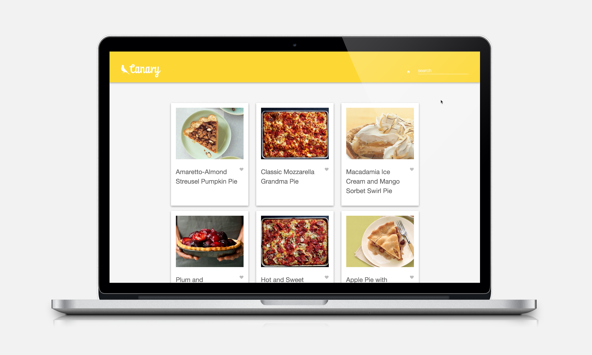
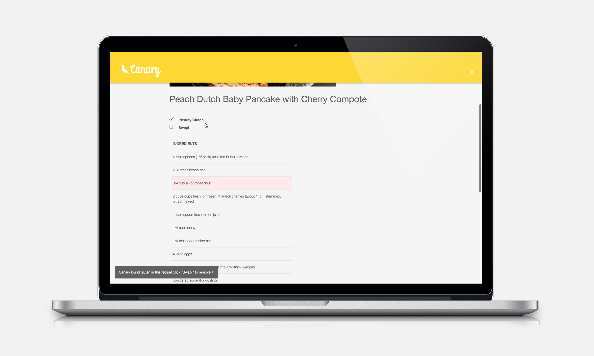
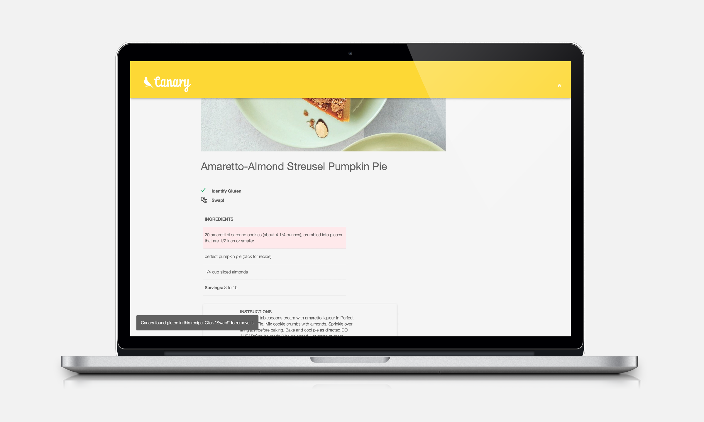

> Learn more about this project by visiting the <a href="http://slides.com/marswilliams/canary">Canary Slide Deck</a>.<br>
> Learn more about the developer by visiting her <a href="https://www.linkedin.com/in/marswilliams">Linkedin</a>.

Canary
================
Bringing tasty back!

Even though food allergies are on the rise, people are often misinformed about which ingredients contain allergens. This confusion can make it difficult to make smart choices when cooking for friends and family with special dietary needs. Canary aims to provide a tool to empower chefs to identify gluten-containing ingredients in existing recipes and recommends healthy alternatives -- without sacrificing taste.

###Contents
<ul>
	<li><a href="#overview">Overview</a></li>
	<li><a href="#technologies-and-stack">Technologies & Stack</a></li>
	<li><a href="#features">Features</a></li>
	<li><a href="#captures">Captures</a></li>
		<ul>
			<li><a href="#user-experience">User Experience</a></li>
			<li><a href="#responsive-design">Responsive Design</a></li>
		</ul>
	<li><a href="#angularjs-directives">AngularJS Directives</a></li>
	<li><a href="#forking">Forking</a></li>
</ul>


Overview
----------------
Canary Features a Responsive Search Interface to Explore Recipes

<h4>The homepage:</h4>
<ul>
	<li>Shows featured recipes</li>
	<li>Links to recipe detail pages, Yummly search, and open recipe search</li>
</ul>



<h4>Recipe detail pages:</h4>
<ul>
	<li>Shows recipe image, ingredients, and instructions</li>
	<li>Users can identify gluten in the recipe and swap out those ingredients for healthy alternatives</li>
	<li>Flour swaps are optimized for taste and texture, and suggestions are displayed in grams for precision</li>
</ul>




<h4>Yummly search:</h4>
<ul>
	<li>Shows featured recipes from Yummly API, adding gluten-free parameter</li>
	<li>Links to recipe detail page on Yummly</li>
</ul>
<h4>OpenRecipes search:</h4>
<ul>
	<li>Shows featured recipes from OpenRecipe project, adding gluten-free parameter</li>
	<li>Links to recipe detail page</li>
</ul>

Technologies and Stack
------------------------
<h4>Backend:</h4>
Python, node.js, Express, Grunt<br>
Python libraries: BeautifulSoup<br>
Data scraping: Scraped thousands of recipes from Bon Appetit, customized scraper to access unique microformat<br>
Data cleaning, sorting: Wrote python scripts to parse the data, clean it, normalize units, and preprocess the data to optimize client-side processes.
Data modeling: Modeled data initially in SQlite, and then in Elasticsearch, creating json documents for seeding

<h4>Frontend:</h4>
JavaScript, AngularJS, jQuery.<br>
HTML5, CSS3, RWD (responsive web design), and Illustrator for graphics.

<h4>APIs:</h4>
Yummly, Elasticsearch.

Features
-------------------
#####Data Visualization and Interaction
- [X] Dynamically display search results, updated by keystroke, with AngularJS two-way data binding
- [X] Elasticsearch allows for free word search, returning 'best match' results, improving search experience
- [X] Elasticsearch nodes mapped to place additional value on hits in recipe name field
- [X] Delightful details: animated gluten identification and swap (with AngularJS directives), attention to typography and layout
- [X] Increase rendering speed by preprocessing data, optimizing key lookup
- [X] Create custom responsive web design (RWD) using CSS3 and material design philosophy

#####Gluten Identification and Swap
- [X] Created an extensive dictionary of gluten-containing ingredients
- [X] Mapped flour types to ratios consisting of taste/texture groupings by: fat, protein, density, lightness, stickiness, texture, starch, binder, and leavener
- [X] Normalized units and quantities with information obtained from USDA documentation
- [X] Swaps are optimized for taste and texture

#####APIs and Cross Origin Resource Sharing
- [X] Enable cross origin resource sharing (CORS) by routing insecure API's through the express server
- [X] Yummly API integration allows users to find additional relevant search results, prefiltered for dietary needs


Captures
-----------------------

###User Experience
<p align="center">

</p>

####User Actions:

######Identifying Gluten and Swap
<p align="center">
	
</p>

####Responsive Design
######Mobile
<p align="center">
<br>
<br>
<br>

</p>


####AngularJS Elements

######Data Binding
```
<tr ng-show={{ingredient.show}} data-field="ingredient" ng-repeat="ingredient in ingredients"	ng-class={{ingredient.glutenClass}}>
   <td>
       <data-field="quantity">{{ingredient.quantity}}
       <data-field="unit">{{ingredient.unit}}
       <data-field="name">{{ingredient.name}}
    </td>
</tr>
<tr ng-hide={{ingredient.substitute.hide}} ng-if="ingredient.substitute.name" data-field="ingredient" ng-repeat="ingredient in ingredients" ng-class={{ingredient.substitute.glutenClass}}>
    <td>
       <data-field="quantity">{{ingredient.quantity}}
       <data-field="unit">{{ingredient.unit}}
       <data-field="substitute">{{ingredient.substitute.name}}
    </td>
</tr>

```


Forking?
-----------------------
You'll need to install node.js, bower, grunt-cli to start.

	`$ ruby -e "$(curl -fsSL https://raw.githubusercontent.com/Homebrew/install/master/install)"`
	`$ brew doctor`
	`$ homebrew install -g node`
	`$ npm install -g bower`
	`$ npm install -g grunt`

Use bower and npm to install dependencies.

	`$ bower install -save`
	`$ npm install -save`

Launch Elasticsearch.

	`$ cd elasticsearch/bin/elasticsearch`

Launch server.

	`$ grunt serve`

I'm happy to answer any questions you may have or help with installation.


